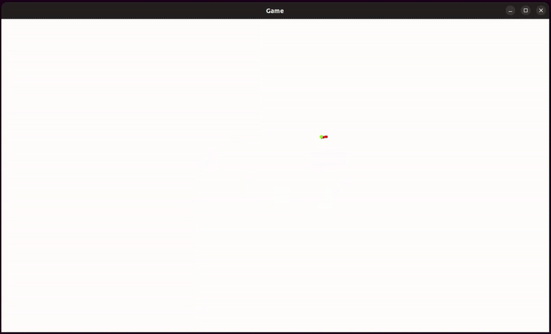

# Turtle language interpreter & viewer

This project implements a simple interpreter for a Logo-inspired Turtle language, capable of parsing `.turtle` files and producing vector drawing commands. 

## 📸 Preview

## Project assignment
For more information about the purpose of this project, you can find the [complete project assignment file](./ressources/project-assignment-fr.pdf) (in french) within this repository. This project is part of the third-year Bachelor's degree in Computer Science at the University of Franche-Comté.

## 👩‍💻 Contributors
- Jade GURNAUD
- Charlotte KRUZIC