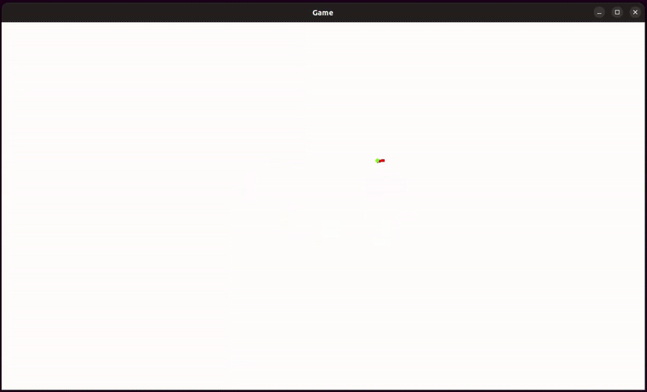

# Turtle language interpreter & viewer
[](https://opensource.org/licenses/MIT)

This project implements a simple interpreter for a Logo-inspired Turtle language, capable of parsing `.turtle` files and producing vector drawing commands. It is composed of two main parts:

- `turtle`: a **C interpreter** that parses and evaluates `.turtle` files, outputting drawing instructions.
- `turtle-viewer`: a **graphical viewer** that takes drawing instructions from the interpreter and animates the turtle's movement.

## 📁 Project structure
```bash
turtle-interpreter/
├── examples/ # Example .turtle programs for testing the interpreter
│ ├── castle.turtle
│ ├── hello.turtle
│ └── ... 
├── resources/ # Additional resources
│ ├── demo.gif
│ └── project-assignment-fr.pdf
├── src/  # Main source code for the project
│ ├── CMakeLists.txt
│ ├── turtle-ast.c  # Construction, evaluation, and destruction of the AST
│ ├── turtle-ast.h
│ ├── turtle-lexer.l # Lexer (Flex)
│ ├── turtle-parser.y # Parser (Bison)
│ ├── turtle-viewer # Precompiled binary viewer (provided)
│ ├── turtle-viewer.cc # Source code for the graphical Turtle viewer (provided)
│ └── turtle.c # Main entry point for the interpreter 
└── README.md
```
> 🔧 The viewer binary `turtle-viewer` is **already compiled and provided**, but its [full source code](src/turtle-viewer.cc) is available if needed.

## ⚙️ Build Instructions
### Requirements

- `CMake >= 2.8`
- `GCC >= 11`
- `Bison` and `Flex`

### Build the interpreter

```bash
cd src
mkdir build && cd build
cmake ..
make
```
> 🔧 This will generate an executable named turtle.

## 🚀 Usage
To run an example:
```bash
./turtle < ../../examples/hello.turtle | ../turtle-viewer
```
> 💡 The interpreter outputs drawing instructions to stdout, which the viewer consumes from stdin.

## 🎮 Contrôles dans le visualiseur
- `Escape`: Exit the viewer
- `F`: Toggle fullscreen
- `Space`: Jump to final drawing
- `Right Arrow`: Step forward in drawing
- `Left Arrow`: Step backward in drawing

## 📸 Preview


## 📝 Project assignment
For more information about the purpose of this project, you can find the [complete project assignment file](./resources/project-assignment-fr.pdf) (in french) within this repository. This project is part of the third-year Bachelor's degree in Computer Science at the University of Franche-Comté.

## 👩‍💻 Contributors
- Jade GURNAUD
- Charlotte KRUZIC
